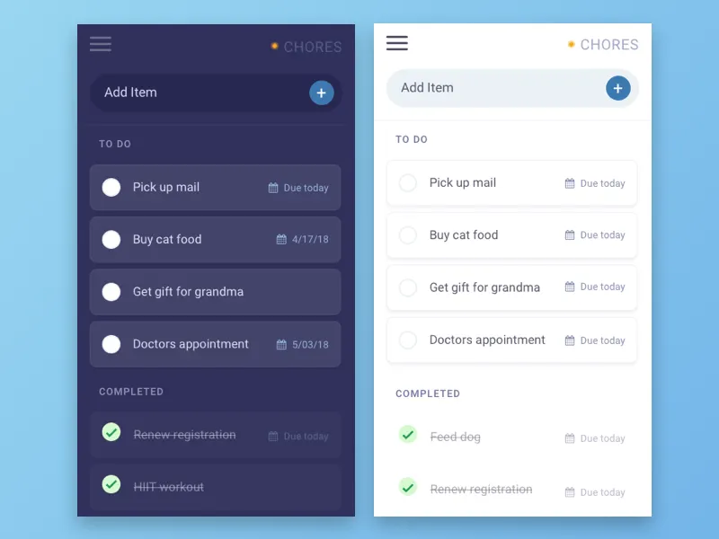
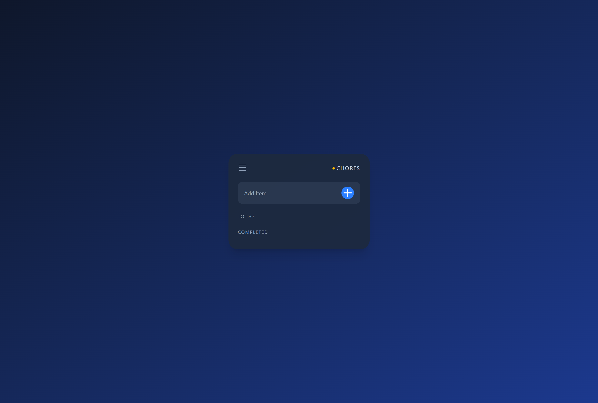
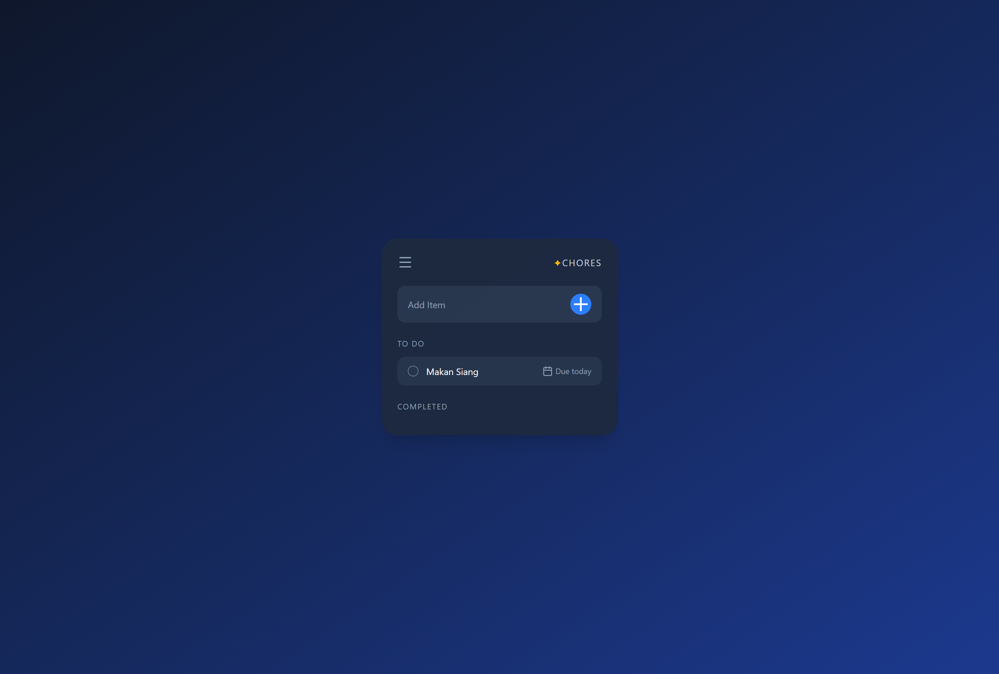
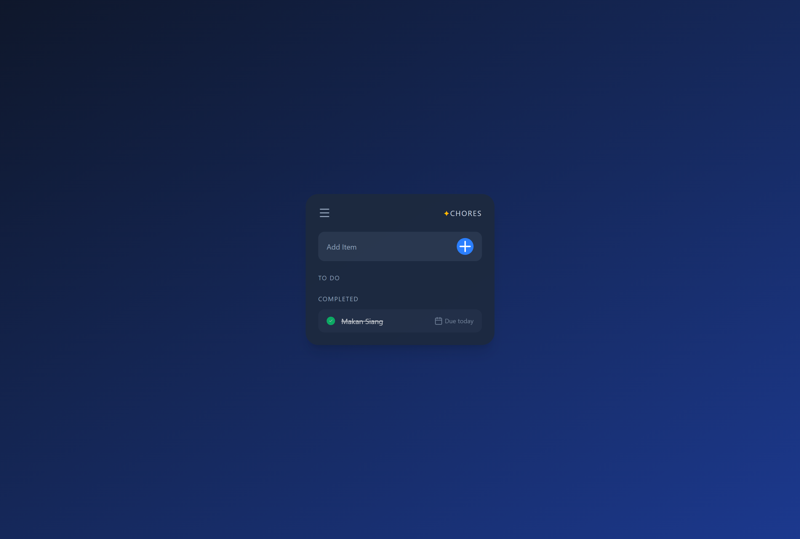

# Todo List Application

Aplikasi ini merupakan aplikasi untuk men track segala aktivitas yang akan dilakukan selama satu hari. Aplikasi ini dibuat dengan menggunakan react dan tailwindcss. Aplikasi ini juga mengusung penggunaan useRef, useState, dan useEffect. Berikut merupakan referensi yang di ambil untuk design aplikasi ini:

## Hasil Jadi Aplikasi

## Cara Menjalankan Aplikasi 
1. Clone repo ini
2. Jalankan melalui terminal dengan menuliskan "npm run dev"
3. Akan muncul link local host dan tinggal click